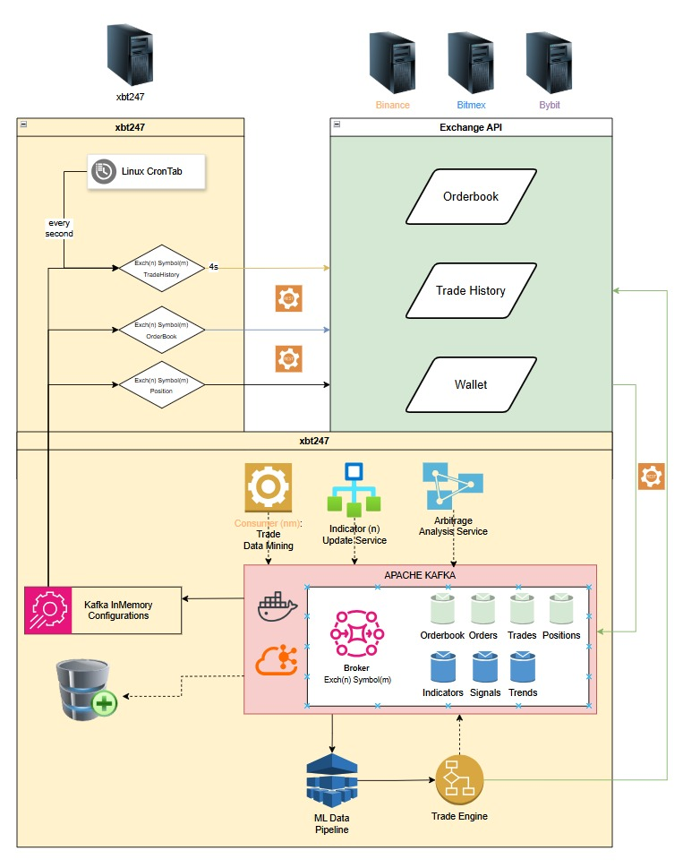

├───application
│   ├───controllers
│   │   └───__pycache__
│   ├───services
│   │   └───__pycache__
│   ├───workers
│   │   └───__pycache__
│   └───__pycache__
├───core
│   ├───domain
│   │   └───__pycache__
│   ├───interfaces
│   │   └───__pycache__
│   ├───use_cases
│   │   └───__pycache__
│   └───__pycache__
├───docker
│   └───server.properties
├───infrastructure
│   ├───config
│   │   └───__pycache__
│   ├───db
│   │   ├───interfaces
│   │   │   └───__pycache__
│   │   ├───repositories
│   │   │   └───__pycache__
│   │   └───__pycache__
│   ├───exchanges
│   │   └───binance
│   │       └───__pycache__
│   ├───messaging
│   │   └───__pycache__
│   ├───persistence
│   │   └───__pycache__
│   └───__pycache__
├───maincontainers
│   └───__pycache__
└───__pycache__